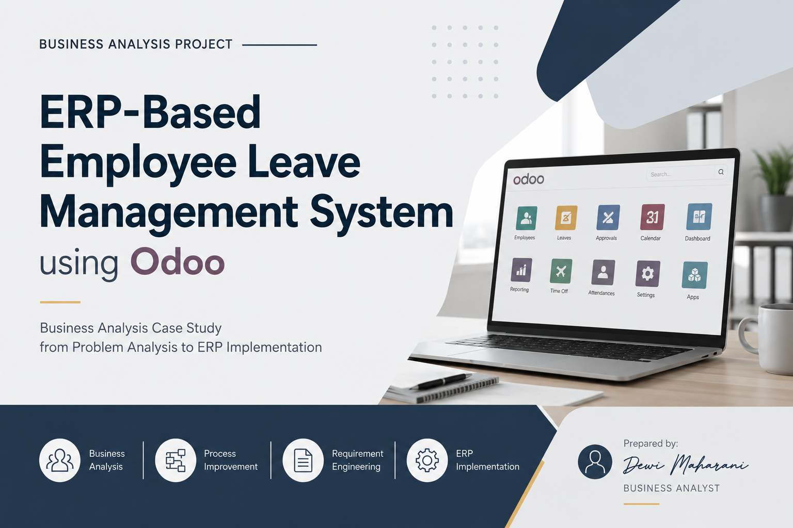

# ERP-Based Employee Leave Management System using Odoo

## 📌 Project Overview

This project presents a Business Analysis case study for designing an **ERP-based Employee Leave Management System using Odoo**.

The project simulates an organization that currently manages employee leave requests through **email and spreadsheets**. The existing process creates challenges in approval coordination, leave data tracking, process visibility, and HR reporting.

The project applies a structured Business Analysis approach to understand the existing process, identify business problems, define requirements, design an improved process, and map the proposed solution to an ERP platform.

### Business Analysis Flow

**Business Problem → Stakeholder Analysis → As-Is Process → Gap Analysis → Requirements → To-Be Process → Odoo Configuration**

---

## 🎯 Business Objective

The objective of this project is to design a centralized leave management solution that can:

- Streamline employee leave request and approval processes
- Reduce manual administrative activities
- Improve visibility of leave request status
- Centralize employee leave data
- Support HR monitoring and reporting
- Provide a foundation for ERP-based process automation

---

## 🔎 Business Context

In the simulated current process, employees submit leave requests through email and leave information is recorded and tracked using spreadsheets.

This approach may result in several business challenges:

| Area | Current Challenge |
|---|---|
| Leave Submission | Requests are handled manually through email |
| Approval | Approval status is difficult to track |
| Data Management | Leave data is maintained separately in spreadsheets |
| Visibility | Employees and HR have limited visibility into request status |
| Administration | HR spends time maintaining and consolidating data |
| Reporting | Generating accurate leave reports requires manual processing |

These challenges indicate the need for a more centralized and structured leave management process.

---

## 🧩 Project Scope

This case study covers the analysis and design of an employee leave management process, including:

- Business problem identification
- Stakeholder identification and analysis
- As-Is business process modeling
- Process gap analysis
- To-Be business process design
- Functional requirement definition
- ERP implementation considerations
- Odoo Leave Management configuration

The project focuses on the **business analysis and process design perspective** rather than custom Odoo module development.

---

## 🔄 Business Analysis Approach

### 1. Business Problem Analysis

The existing leave management process is analyzed to understand the underlying business problems, their impact, and the need for process improvement.

### 2. Stakeholder Analysis

Relevant stakeholders are identified based on their roles and involvement in the leave management process.

Key stakeholders include:

- Employee
- Manager
- Human Resources
- System / ERP

### 3. As-Is Process Modeling

The current leave request and approval workflow is modeled using BPMN to visualize how the process works before ERP implementation.

**Current Process:**

The BPMN model provides a baseline for identifying inefficiencies and improvement opportunities.

### 4. Process Gap Analysis

The As-Is process is compared with the desired business process to identify gaps related to:

- Manual activities
- Approval visibility
- Data centralization
- Process tracking
- Notification
- Reporting

### 5. To-Be Process Design

A future-state process is designed to address the identified gaps and introduce a more centralized workflow supported by an ERP system.

### 6. Functional Requirements

Business needs are translated into functional requirements that describe what the system should support.

Examples include:

| ID | Requirement |
|---|---|
| FR-01 | Kelola Data Employee |
| FR-02 | Kelola Hubungan Manager-Employee |
| FR-03 | Kelola User & Hak Akses |
| FR-04 | Konfigurasi Leave Type |
| FR-05 | Konfigurasi Approval Workflow |
| FR-06 | Lihat Saldo Cuti |

### 7. Odoo Configuration

The proposed business process is mapped to the **Odoo Leave Management module**.

The configuration analysis considers how Odoo can support the defined business requirements, approval workflow, notifications, leave types, and reporting needs.

---

## 📊 Key Process Improvements

The proposed ERP-based process aims to transform the leave management process from a fragmented manual workflow into a centralized digital workflow.

| Before | After |
|---|---|
| Email-based requests | System-based requests |
| Spreadsheet tracking | Centralized leave records |
| Manual status tracking | System-based approval status |
| Limited visibility | Better process visibility |
| Manual administrative work | Reduced manual activities |
| Difficult reporting | Centralized data for reporting |

---

## 📂 Project Documentation

The detailed analysis and supporting artifacts are organized into separate documents.

| No. | Documentation | Description |
|---|---|---|
| 01 | [Business Problem Analysis](./01_Business_Problem_Analysis.pdf) | Identifies the current business problems, impacts, and business needs |
| 02 | [Stakeholder Analysis](./02_Stakeholder_Analysis.xlsx) | Identifies stakeholders and analyzes their roles and involvement |
| 03 | [As-Is BPMN](./03_As%20Is%20BPMN.png) | Models the existing employee leave management process |
| 04 | [Process Gap Analysis](./04_Process%20Gap%20Analysis.png) | Compares the current process with the desired future state |
| 05 | [To-Be BPMN](./05_To-Be%20BPMN.png) | Designs the improved future-state business process |
| 06 | [Functional Requirements](./06_Functional%20Requirement%20Document.pdf) | Defines functional requirements derived from business needs |
| 07 | [Odoo Configuration](./07_Odoo%20Configuration%20Documentation.pdf) | Documents how the proposed process is mapped to Odoo |

> **Note:** Each folder contains the detailed analysis, diagrams, and supporting documentation for the corresponding Business Analysis activity.

---

## 🛠 Tools & Technologies

| Category | Tools |
|---|---|
| ERP Platform | Odoo |
| Business Process Modeling | BPMN.io / Draw.io |
| Documentation | Microsoft Office |
| Version Control | GitHub |

---

## 📚 Related Learning

This project is part of my Business Analyst learning journey.

The accompanying blog discusses the theoretical concepts behind the activities applied in this project, including:

- Business Analysis
- Business Problem Analysis
- Stakeholder Analysis
- Business Process Modeling
- Requirements Engineering
- ERP Implementation

🔗 **[Business Analyst Learning Blog](https://dewimhr7.wordpress.com/)**

---

## 🌐 Portfolio & Related Resources

| Resource | Link |
|---|---|
| Portfolio Website | [Dewi Maharani Portfolio](https://dwmhr.vercel.app/) |
| Business Analyst Blog | [Dewi Maharani Blog](https://dewimhr7.wordpress.com/) |
| GitHub Profile | [dwmhr12](https://github.com/dwmhr12) |

---

## 👩‍💻 Author

**Dewi Maharani**

Information Systems Graduate | Business Analyst
