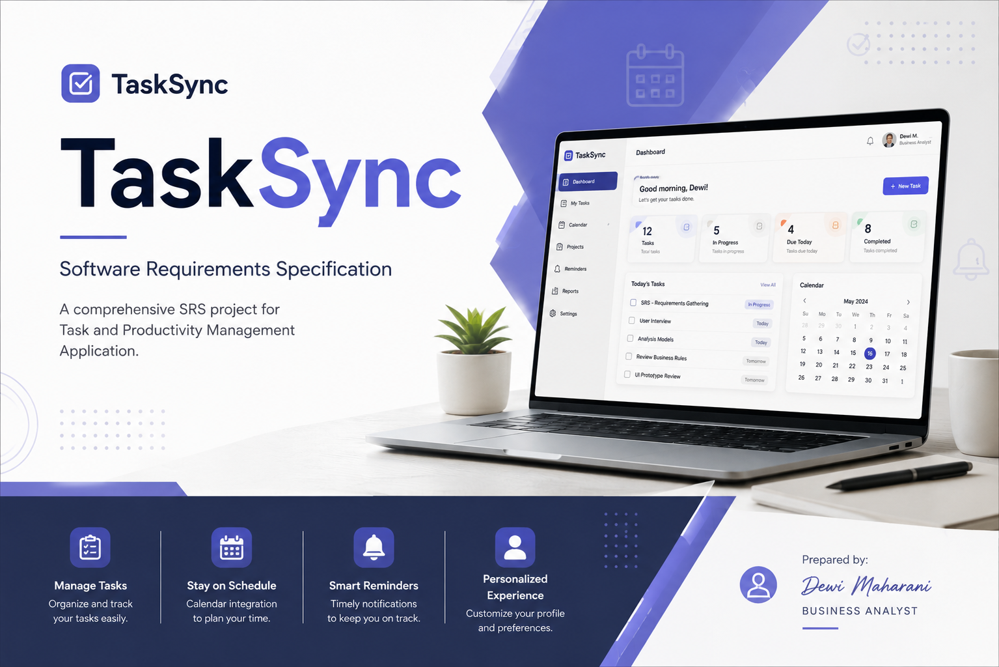

# TaskSync – Smart Academic Task Management

## 📌 Project Overview

This project presents a Software Requirements Specification (SRS) for **TaskSync – Smart Academic Task Management**, a cross-platform mobile application (Android & iOS) designed to help university students manage academic and non-academic tasks, schedules, and activities through a single integrated platform.

TaskSync automatically syncs assignments, deadlines, and academic announcements from **myITS Classroom** (the university's Learning Management System), and integrates with **Google Calendar** so users can track their schedule in one place. Users can also manually add and manage non-academic activities alongside their academic tasks.

The project demonstrates the process of translating user needs and business objectives into structured software requirements. The SRS covers the product scope, functional and non-functional requirements, business rules, system interfaces, and system analysis models that serve as a foundation for system design and development.

## 🎯 Project Objective

The objective of this project is to define a clear and structured software requirements specification for TaskSync that can:

- Authenticate users through their myITS account
- Support academic task management, including automatic synchronization from myITS Classroom
- Support manual management of non-academic tasks and activities
- Provide a calendar view integrated with Google Calendar
- Provide notifications and reminders for new tasks, announcements, and upcoming deadlines
- Enable user profile management
- Provide an in-app FAQ / help center
- Enable application settings, including notification preferences and account integration management
- Define functional and non-functional requirements
- Establish business rules and system constraints
- Provide system analysis and modeling artifacts (use case diagram, use case scenarios)
- Serve as a foundation for UI/UX design and software development

## 📂 Project Documentation

The project documentation has been consolidated into a single Software Requirements Specification (SRS) document to provide a more integrated view of the system requirements.

| Document | Description |
|---|---|
| Software Requirements Specification (SRS) | Comprehensive requirements document covering product overview, scope, users, operating environment, constraints and assumptions, external interface requirements, system features (Login, Task Management, Calendar, Notifications, Profile, FAQ, Settings), non-functional requirements, business rules, and system analysis models |
| Prototype | Proposed TaskSync UI/UX design (Login, Home, Manage Task, Calendar, Notification, Profile, FAQ, Settings screens), developed based on the defined requirements |

### SRS Contents

The SRS document includes:

- **Introduction** — Purpose, document conventions, intended audience, product scope, and references (based on IEEE Std 830-1998)
- **Overall Description** — Product perspective, product functions, user classes and characteristics, operating environment, design and implementation constraints, user documentation, assumptions and dependencies
- **External Interface Requirements** — User interfaces (with UI prototype screens), hardware interfaces, software interfaces (myITS Classroom, Google Calendar, OS notification services, myITS authentication), and communication interfaces (HTTPS/TLS, REST APIs)
- **System Features** — Detailed functional requirements and use case scenarios for seven core features: Login (Masuk Akun), Task Management (Kelola Tugas), Calendar Management (Kelola Kalender), Notification Management (Kelola Notifikasi), Profile Management (Kelola Profil), FAQ, and Settings (Pengaturan)
- **Non-Functional Requirements** — Performance, safety, security, quality attributes (usability, security, adaptability, availability, flexibility), and business rules
- **Analysis Models** — Use case diagram and actor/use case descriptions illustrating system scope and interactions

## 🔄 Requirements Engineering Process

The project follows a structured requirements engineering approach:

**User Needs → Product Scope → Requirements → Business Rules → System Analysis → UI/UX Prototype**

This approach ensures that the proposed interface and system behavior are aligned with the documented requirements.

## 🛠 Tools & Technologies

| Category | Tools |
|---|---|
| Requirements Documentation | Microsoft Office |
| System Modeling | UML / Draw.io |
| UI/UX Design | Figma |
| Version Control | GitHub |

## 🌐 Portfolio & Learning Resources

This project is part of my Business Analyst and System Analyst portfolio, documenting practical work related to requirements engineering, system analysis, business process modeling, and solution design.

| Resource | Link |
|---|---|
| Portfolio Website | Dewi Maharani Portfolio |
| Business Analyst Blog | Dewi Maharani Blog |
| GitHub Profile | github.com/dwmhr12 |

## 👩‍💻 Author

**Dewi Maharani**

GitHub: github.com/dwmhr12
